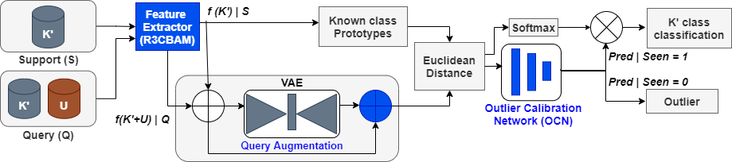
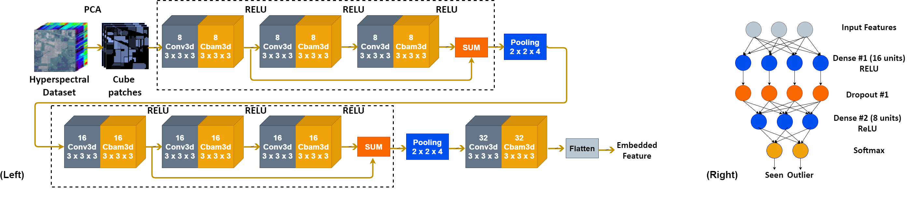
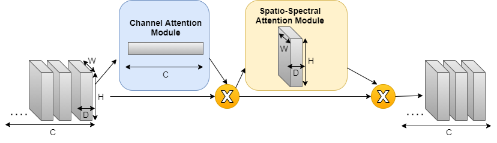
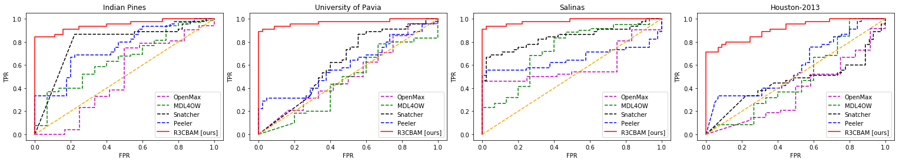

# Few-Shot Open-Set Recognition of Hyperspectral Images with Outlier Calibration Network (OCN)

The code repository for "Few-Shot Open-Set Recognition of Hyperspectral Images with Outlier Calibration Network" [[paper]](https://openaccess.thecvf.com/content/WACV2022/papers/Pal_Few-Shot_Open-Set_Recognition_of_Hyperspectral_Images_With_Outlier_Calibration_Network_WACV_2022_paper.pdf) (WACV'22) in Tensorflow. 

## Abstract

We tackle the few-shot open-set recognition (FSOSR) problem in the context of remote sensing hyperspectral image (HSI) classification. Prior research on OSR mainly considers an empirical threshold on the class prediction scores to reject the outlier samples. Further, recent endeavors in few-shot HSI classification fail to recognize outliers due to the `closed-set' nature of the problem and the fact that the entire class distributions are unknown during training. To this end, we propose to optimize a novel outlier calibration network (OCN) together with a feature extraction module during the meta-training phase. The feature extractor is equipped with a novel residual 3D convolutional block attention network (R3CBAM) for enhanced spectral-spatial feature learning from HSI. Our method rejects the outliers based on OCN prediction scores barring the need for manual thresholding. Finally, we propose to augment the query set with synthesized support set features during the similarity learning stage in order to combat the data scarcity issue of few-shot learning. The superiority of the proposed model is showcased on four benchmark HSI datasets.

### Feature extractor - R3CBAM and OCN

### CBAM3D layer

## Prerequisites

The following packages are required to run the scripts:

- [Tensorflow 2.x](https://www.tensorflow.org/)
- [opencv 4.1.0](https://pypi.org/project/opencv-python/)
- [numpy 1.16.4](https://numpy.org/)
- [scipy 1.3.0](https://scipy.org/)
- [sklearn 0.21.2](https://scikit-learn.org/stable/)
- [matplotlib 3.1.1](https://matplotlib.org/)

## Dataset

### Indian Pines, Salinas, Pavia University
Download from (http://www.ehu.eus/ccwintco/index.php/Hyperspectral_Remote_Sensing_Scenes) 

### Houston-2013
Download from (https://hyperspectral.ee.uh.edu/?page_id=459)

## Source Code
The codes for meta-training, fine-tuning and meta-testing on 4 benchmark HSI datasets are available in src folder with name as "OCN_<Dataset_name>".  The code is configured for 3-way 5-shot open-set recognition.
 
## Outlier detection result

The AUROC comparison of our method agaist other methods is shown  below.

  

## Citation
If you use any content of this repo for your work, please cite the following bib entry:

	@InProceedings{Pal_2022_WACV,
    author    = {Pal, Debabrata and Bundele, Valay and Sharma, Renuka and Banerjee, Biplab and Jeppu, Yogananda},
    title     = {Few-Shot Open-Set Recognition of Hyperspectral Images With Outlier Calibration Network},
    booktitle = {Proceedings of the IEEE/CVF Winter Conference on Applications of Computer Vision (WACV)},
    month     = {January},
    year      = {2022},
    pages     = {3801-3810}
	}

## Licence
OCN is released under the MIT license. 

Copyright (c) 2022 Debabrata Pal. All rights reserved.
